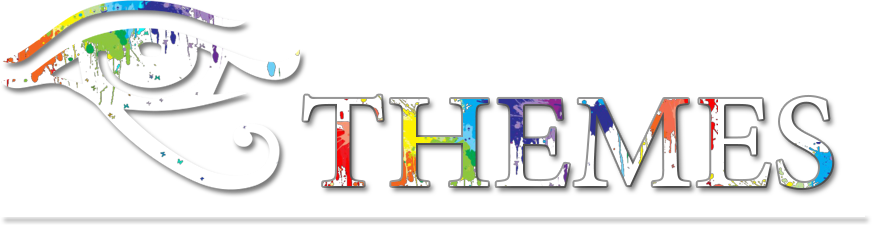

 

  

  <i>A repository containing themes for <a href="https://ivfi.io/">IVFi</a></i>

 

 
  For usage instructions, see the relevant repository:

 
  <a href="https://github.com/sixem/ivfi-php">IVFi-PHP</a>
  |
  <a href="https://github.com/sixem/ivfi-node">IVFi-Node</a>

 

---

## White
> _A simple bright, white theme._

Preview

 

---

## Amethyst

> _A dark, purple theme based on the colors of the amethyst._

Preview

 

---

## Antique

Contributed by: [@v1rx](https://github.com/v1rx)

> _An old school, dark, and high contrast theme._

Preview

 

---

## Coral

> _A turquoise and greenish theme._

Preview

 

---

## Ayu-Mirage

Contributed by: [@evwltrs](https://github.com/evwltrs)

> _Inspired by the [ayu-mirage](https://github.com/ayu-theme/ayu-colors) theme._

Preview

 

---

## Gruvbox

Contributed by: [@evwltrs](https://github.com/evwltrs)

> _Inspired by the classic vim theme [gruvbox](https://github.com/morhetz/gruvbox)._

Preview

 

---

 

<h1>Do you want to contribute?</h1>

If you've created a nice theme, feel free to submit a <a href="https://github.com/sixem/ivfi-themes/pulls">pull request</a> with it!

Themes are created by simply overriding any existing CSS values. A theme should consist of a a directory with a stylesheet matching the name of the directory, which should also be the name of the theme. Any assets can be imported from the theme's directory. However, it's important to note that any assets must be open source when submitted, and any credit must also be provided if necessary.

<h1>License</h1>

> Licensed under the MIT license
