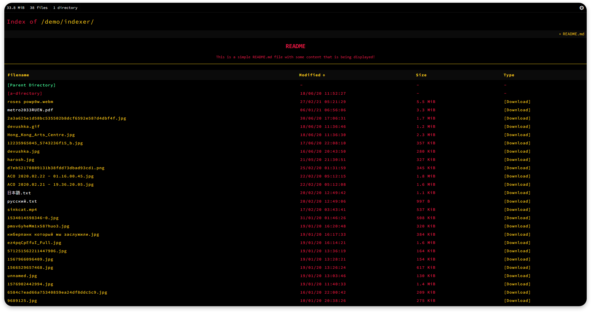

 

  

  <i>A repository containing themes for <a href="https://ivfi.io/">IVFi</a></i>

 

 
  For usage instructions, see the documentation of the relevant repository:

 
  <a href="https://ivfi.io/docs/php/#/themes">IVFi-PHP</a>
  |
  <a href="https://ivfi.io/docs/node/#/configuration?id=style">IVFi-Node</a>

  

## Amethyst
> _A dark, purple theme based on the colors of the amethyst._

## Antique
Contributed by: [@v1rx](https://github.com/v1rx)

> _A dark and high contrast theme with an old school vibe._

## Coral
> _A simple blue theme._

## Ayu-Mirage
Contributed by: [@evwltrs](https://github.com/evwltrs)

> _Inspired by the [ayu-mirage](https://github.com/ayu-theme/ayu-colors) theme._

## Gruvbox
Contributed by: [@evwltrs](https://github.com/evwltrs)

> _Inspired by the classic vim theme [gruvbox](https://github.com/morhetz/gruvbox)._

## Caligo
> _A dimmed, darker version of the default theme._

## Command
> _A dark gray monospace theme with shades of green._

## White
> _A simple bright, white theme._

 

<h1>Do you want to contribute?</h1>

If you've created a nice theme, feel free to submit a <a href="https://github.com/sixem/ivfi-themes/pulls">pull request</a> with it!

Themes are created by simply overriding any existing CSS values. A theme should consist of a a directory with a stylesheet matching the name of the directory, which should also be the name of the theme. Any assets can be imported from the theme's directory. However, it's important to note that any assets must be open source when submitted, and any credit must also be provided if necessary.

<h1>License</h1>

> Licensed under the MIT license
